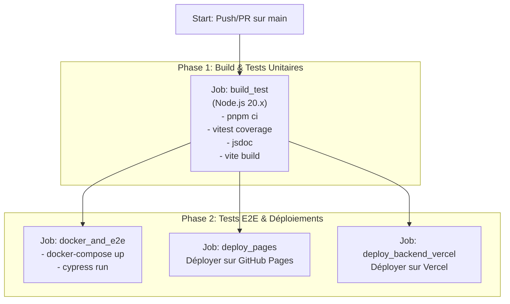

# React Form Project - Full Stack Application

[](https://github.com/varlopecar/react-form/actions/workflows/ci-cd.yml)
[](https://app.codecov.io/gh/varlopecar/react-form)

## 🚀 Démo en Ligne

Visitez la démo en ligne : [https://varlopecar.github.io/react-form/](https://varlopecar.github.io/react-form/)

## 🌟 Fonctionnalités Clés

- **Formulaire d'inscription complet** avec validation en temps réel
- **Backend RESTful** pour la gestion des utilisateurs (création, lecture, suppression)
- **Authentification administrateur** sécurisée avec JWT
- **Base de données MySQL** persistante
- **Tests unitaires, d'intégration et E2E** pour garantir la qualité du code
- **Pipeline CI/CD automatisée** pour les tests, le build, et les déploiements
- **Déploiement du frontend** sur GitHub Pages et du **backend** sur Vercel

## 🛠️ Stack Technique

| Domaine             | Outil                                                                                                                             | Rôle                                  |
| ------------------- | --------------------------------------------------------------------------------------------------------------------------------- | ------------------------------------- |
| **Frontend**        | [**React**](https://react.dev/) / [**Vite**](https://vitejs.dev/)                                                                 | Interface utilisateur et build        |
| **Backend**         | [**FastAPI**](https://fastapi.tiangolo.com/)                                                                                      | API RESTful en Python                 |
| **Base de Données** | [**MySQL**](https://www.mysql.com/)                                                                                               | Stockage des données des utilisateurs |
| **Tests**           | [**Vitest**](https://vitest.dev/) / [**Cypress**](https://www.cypress.io/)                                                        | Tests unitaires, intégration et E2E   |
| **CI/CD**           | [**GitHub Actions**](https://github.com/features/actions) / [**Docker**](https://www.docker.com/)                                 | Automatisation et conteneurisation    |
| **Hébergement**     | [**GitHub Pages**](https://pages.github.com/) / [**Vercel**](https://vercel.com/) / [**AlwaysData**](https://www.alwaysdata.com/) | Déploiement Front, Back et BDD        |
| **Qualité**         | [**ESLint**](https://eslint.org/) / [**Codecov**](https://about.codecov.io/)                                                      | Linter et couverture de tests         |

## 🚀 Démarrage Rapide

### Prérequis

- Node.js (v20.x recommandée)
- Docker et Docker Compose

### 1. Installation (sans Docker)

Pour lancer uniquement le frontend en local (connecté à l'API de production).

```bash
# Cloner le projet
git clone https://github.com/varlopecar/react-form.git
cd react-form

# Installer les dépendances
pnpm install

# Lancer le serveur de développement
pnpm dev
```

### 2. Lancer l'environnement complet avec Docker (Recommandé)

Cette méthode lance le frontend, le backend et la base de données dans des conteneurs isolés.

**a. Créez un fichier `.env`** à la racine en vous basant sur `env.example` :

```bash
# Base de données MySQL (pour Docker)
MYSQL_DATABASE=react_form
MYSQL_USER=user
MYSQL_PASSWORD=password
MYSQL_ROOT_PASSWORD=root
MYSQL_HOST=mysql

# Configuration FastAPI
PORT=8000

# Compte administrateur injecté dans la BDD de test
ADMIN_EMAIL=admin@example.com
ADMIN_PASSWORD=admin123

# JWT Secret
JWT_SECRET=your-secret-key-here

# Frontend API URL
VITE_API_URL=http://localhost:8000
```

**b. Lancez les services avec Docker Compose :**

```bash
docker-compose up --build
```

- Le frontend sera accessible sur `http://localhost:3000`
- Le backend sur `http://localhost:8000`
- La base de données est gérable via Adminer sur `http://localhost:8080`

## 🧪 Tests

- **Lancer les tests unitaires et d'intégration :**

  ```bash
  pnpm run test
  ```

- **Générer le rapport de couverture :**

  ```bash
  pnpm run coverage
  ```

  Le rapport est visible dans le dossier `coverage/`

- **Lancer les tests End-to-End (E2E) avec Cypress :** _(Assurez-vous que l'environnement Docker est lancé)_

  ```bash
  # Lancer en mode console
  pnpm run cypress:run

  # Ouvrir l'interface graphique de Cypress
  pnpm run cypress:open
  ```

## 🔄 Pipeline CI/CD

La pipeline GitHub Actions automatise l'ensemble du cycle de vie de l'application.



## 📚 Documentation

La documentation technique des composants React est générée avec JSDoc.

```bash
pnpm run doc
```

Le résultat est disponible dans le dossier `public/docs`.

## 📡 Endpoints API

### API de Gestion des Utilisateurs (Python FastAPI)

- `POST /register` - Inscription utilisateur
- `POST /login` - Authentification utilisateur
- `GET /users` - Obtenir tous les utilisateurs (admin seulement)
- `DELETE /users/{id}` - Supprimer un utilisateur (admin seulement)
- `GET /me` - Obtenir les informations de l'utilisateur actuel
- `GET /health` - Vérification de santé de l'API

## 👤 Rôles Utilisateurs

### Utilisateurs Réguliers

- Peuvent s'inscrire et se connecter
- Peuvent voir la page d'accueil
- Peuvent voir la liste des utilisateurs avec informations réduites

### Utilisateurs Admin

- Toutes les permissions des utilisateurs réguliers
- Peuvent voir les informations complètes des utilisateurs
- Peuvent supprimer les utilisateurs non-admin

## 🐳 Commandes Docker

```bash
# Démarrer les services
pnpm run docker:up

# Arrêter les services
pnpm run docker:down

# Reconstruire les images
pnpm run docker:build

# Voir les logs
pnpm run docker:logs
```

## 📦 Scripts Disponibles

```bash
# Développement
pnpm dev          # Lancer le serveur de développement
pnpm build        # Build pour la production
pnpm preview      # Prévisualiser le build

# Tests
pnpm test         # Lancer les tests
pnpm coverage     # Générer le rapport de couverture
pnpm cypress:run  # Tests E2E en mode console
pnpm cypress:open # Ouvrir Cypress UI

# Qualité
pnpm lint         # Linter le code
pnpm doc          # Générer la documentation

# Déploiement
pnpm deploy       # Déployer sur GitHub Pages
```

## ✍️ Auteur

Projet réalisé par **Varlopecar**.
